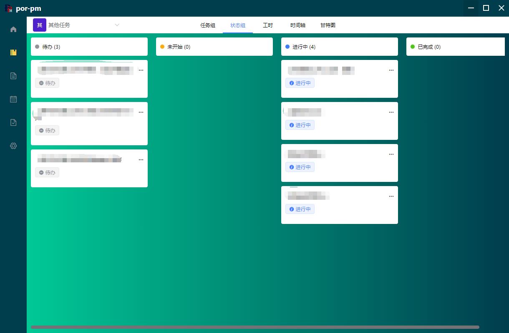
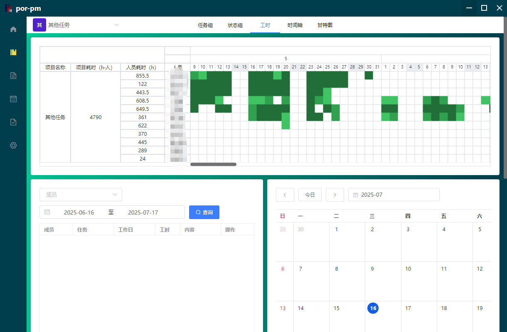

# 我的项目管理工具

自2022年开发成型后，本人在工作上一直使用至今。且作为蓝本推送了公司pmo系统的开发使用

## 💼 项目

以项目为中心，进行任务管理

* 创建项目
* 管理项目

## ⏲ 任务

学习jira思想，按任务维护

* 在项目中创建任务分组
* 创建任务，并关联分组
* 分配任务关联人
* 上报进度
* 修改任务状态

## 💹统计

上报后，自动生成报表，免去统计烦恼

* 任务-人员-工时
* 人员-任务-工时
* 任务日历

## 💻界面

### 首页

展示最近的日志上报情况，当前未开始、进行中的任务

人员工时耗费分布情况

人员工时耗费统计

### 项目列表

展示用户的项目清单，界面分为固定3块，用户可根据自己喜好随意改变项目位置

### 项目面板

#### 任务组

以自定义分组列的形式展示任务，任务具有状态属性，可分配人员并填写预计工时

列的名称及位置（拖动）可自定义。卡片位置（拖动）可自定义

支持上报日报，记录任务所用工时

#### 状态组

支持按状态查看项目中的任务

#### 工时视图

支持查看项目耗费工时情况及日报情况

支持按任务查看人员参与情况

支持查看上报详情、工时日历、趋势统计、人员统计

#### 时间轴视图

支持根据填写的预计执行情况（计划开始、截止时间），生成时间轴

#### 甘特图视图

支持导入并创建项目甘特图

### 活跃任务视图

支持按状态查看全部任务，并通过拖动，改变任务状态

### 日报视图

支持查看日报填写情况

### 归档视图

完成并归档的任务，可在归档视图中查看

